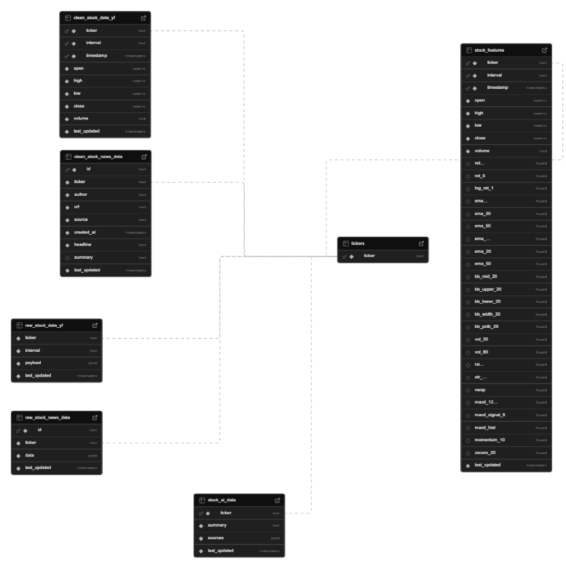

# Stock Pipeline - Data Pipeline For Stock Analysis

## Overview

Stock Pipeline is a containerized ELT system that ingests real-time and historical market data (OHLCV, trades, quotes) plus ticker news, then organizes it into a Supabase Postgres medallion schema: **raw → clean → features → AI**. It supports replayable backfills, conflict-aware upserts, and feature generation for downstream screening, modeling, dashboards, and APIs. It also includes an AI summarization layer that reads recent articles per ticker and stores grounded, source-linked summaries for your application.

## Key Features

- **Containerized Architecture** — Fully Dockerized for consistent dev/prod deployment
- **Automated Data Collection** — Scheduled pulls for OHLCV + news across configured tickers
- **Medallion Database Schema** — Raw → Clean → Feature → AI tables in Supabase Postgres for traceability
- **Replayable ETL + Backfills** — Idempotent loads with conflict-aware upserts to keep history consistent
- **Real-Time Market Ingestion** — Async WebSockets for trades/NBBO/minute bars to support live monitoring
- **Feature Engineering Layer** — Returns, SMA/EMA, Bollinger Bands, volatility + momentum/RSI/MACD/ATR/VWAP
- **News Pipeline** — Ingests articles, normalizes metadata (headline, source, timestamps, url), dedupes by URL
- **AI Ticker Summaries** — AI agents read recent news and generate grounded ticker summaries with sources
- **Data Quality + Observability** — Structured logging, freshness checks, and basic anomaly/missing-data detection
- **Easy Setup** — One-command bootstrap + seeded tickers for fast start
- **Python-Based** — Uses popular Python data/ML tooling for analysis and downstream modeling

## Impact / KPIs

- **Coverage:** 230+ tickers across **1m–1d** intervals (configurable universe)
- **Reliability:** Replayable backfills + idempotent upserts to keep history consistent over time
- **Latency:** Real-time ingestion path for trades/NBBO/minute bars (async WebSockets)
- **Data Quality:** Deterministic keys + dedupe rules (e.g., news by URL) to reduce duplicates and bad rows
- **Cost Control:** Scheduled AI summaries + caching to reduce unnecessary external API calls

## What I Learned (Key Takeaways)

- **Designing “medallion” schemas in Postgres:** raw JSON landing → typed clean tables → feature tables → serving/AI tables, with clear keys for joins and upserts.
- **Idempotent pipelines matter:** backfills, retries, and conflict-aware upserts are required for long-running market data systems.
- **Streaming + batch is a different game:** real-time feeds need async ingestion, buffering, and careful monitoring for disconnects/gaps.
- **Feature engineering is a product decision:** choosing stable indicators (returns, SMA/EMA, Bollinger, volatility) and handling warm-up periods (NULL features) is essential for modeling.
- **News is messy:** normalization, deduplication, and consistent timestamps are critical before using it for retrieval or summarization.
- **LLMs need guardrails:** grounded summarization with sources + caching prevents hallucinations and keeps costs predictable.
- **Observability saves time:** structured logs, freshness checks, and missing-data alerts reduce debugging time dramatically.

## Data Sources

The pipeline uses yFiance for historical ticker data, and Alapaca for live websocket data and news data.


## Database Schema



## Project Structure

```

```

## Installation & Setup

### Requirements

- **Docker** (for containerized services)
- **Docker Compose** (to run the full stack locally)
- **Python 3.10+** (local development / scripts; match your project’s runtime)
- **pip** (Python dependency management)
- **Supabase Postgres** (database backend; local or hosted)
- **API keys** (as environment variables):
  - **Alpaca** (market data + news)
  - **Yahoo Finance** (if used for historical pulls)
- *(Optional)* **AWS credentials** (only if deploying to App Runner/other AWS services)
  
### Mac/Linux

1. **Clone the repository**
   ```bash
   git clone <repository-url>
   cd stock-pipeline
   ```

2. **Run setup script** (in a new terminal)
   ```bash
   ./scripts/setup.ps1
   ```

3. **Set .env variables** 
   ```
   OPEN_AI_KEY=...
   ..
   ..
   ..
   ```
4. **Make Supabase project and load db Schema**
   - Paste contents of ``` init_db.sql ``` into Supabase SQL Editor

### Windows

1. **Clone the repository**
   ```powershell
   git clone <repository-url>
   cd stock-pipeline
   ```

2. **Run setup script** (in a new PowerShell terminal)
   ```powershell
   .\scripts\setup.ps1
   ```

3. **Set .env variables** 
   ```
   OPEN_AI_KEY=...
   ...
   ...
   ```
4. **Make Supabase project and load db Schema**
   - Paste contents of ``` init_db.sql ``` into Supabase SQL Editor


## Usage

### Starting the Pipeline

```
```

This starts all services in detached mode.

### Stopping the Pipeline

```
```

### Viewing Logs

```
```


### Running Specific Script

```
```
